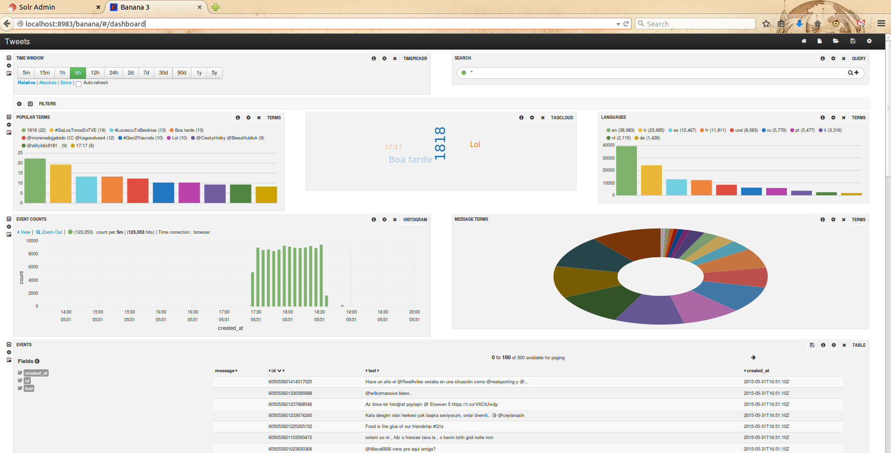

Solr Banana Configuration
=======================================

[Banana](https://github.com/LucidWorks/banana) is a fork project from [Kibana](https://www.elastic.co/products/kibana)
with the main purpose of allowing an easy overview of the data contained within Solr.

For the purpose of this example project the banana web application can be runned on the same jetty server on which
the Solr server is running.
In order to achieve this functionality simply create within $SOLR_HOME/server/contexts a separate context for the banana
application (see contexts/banana-jetty-context.xml file).
Place afterwards the banana.war (see instructions from  https://github.com/LucidWorks/banana page on how to build the
banana application) application within  $SOLR_HOME/server/webapps and simply start the Solr server :

```
SOLR_HOME $ bin/solr start
```

Once there is some twitter data imported this is one dashboard that can be made within banana :



To make use of the dashboard shown in the example above, it needs to be imported within banana from the file
dashboards/tweets-banana-dashboard.json